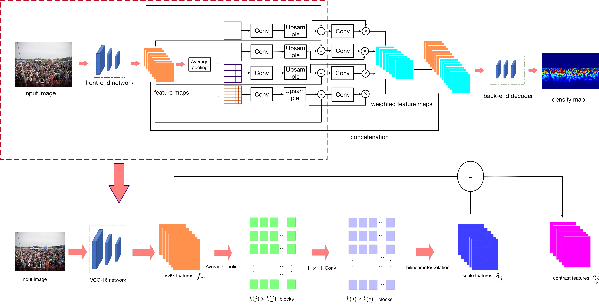
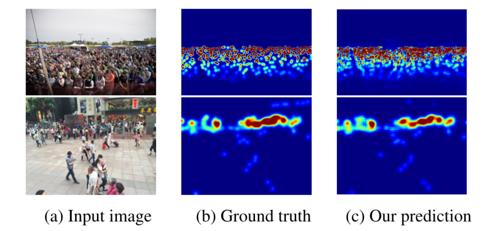

# Context-Aware Crowd Counting

This repository is a PyTorch implementation for the paper **Context-Aware Crowd Counting**. Shubhendu Shubham. If you use this code in your research, please cite
[the paper](http://openaccess.thecvf.com/content_CVPR_2019/papers/Liu_Context-Aware_Crowd_Counting_CVPR_2019_paper.pdf).

State-of-the-art methods for counting people in crowded scenes rely on deep networks to estimate crowd density. They typically use the same filters over the whole image or over large image patches. Only then do they estimate local scale to compensate for perspective distortion. This is typically achieved by training an auxiliary classifier to select, for predefined image patches, the best kernel size among a limited set of choices. As such, these methods are not endto-end trainable and restricted in the scope of context they can leverage.

In this paper, we introduce an end-to-end trainable deep architecture that combines features obtained using multiple receptive field sizes and learns the importance of each such feature at each image location. In other words, our approach adaptively encodes the scale of the contextual information required to accurately predict crowd density. This yields an algorithm that outperforms state-of-the-art crowd counting methods, especially when perspective effects are strong.

Figure 1: Context-Aware Network. (Top) RGB images are fed to a font-end network that comprises the first 10 layers of the VGG-16
network. The resulting local features are grouped in blocks of different sizes by average pooling followed by a 1×1 convolutional layer.
They are then up-sampled back to the original feature size to form the contrast features. Contrast features are further used to learn the
weights for the scale-aware features that are then fed to a back-end network to produce the final density map. (Bottom) As shown in this
expanded version of the first part of the network, the contrast features are the difference between local features and context features.

Figure 2: Crowd density estimation on ShanghaiTech. First
row: Image from Part A. Second row: Image from Part B. Our
model adjusts to rapid scale changes and delivers density maps
that are close to the ground truth.

## Installation
PyTorch 0.4.1

Python 2.7

